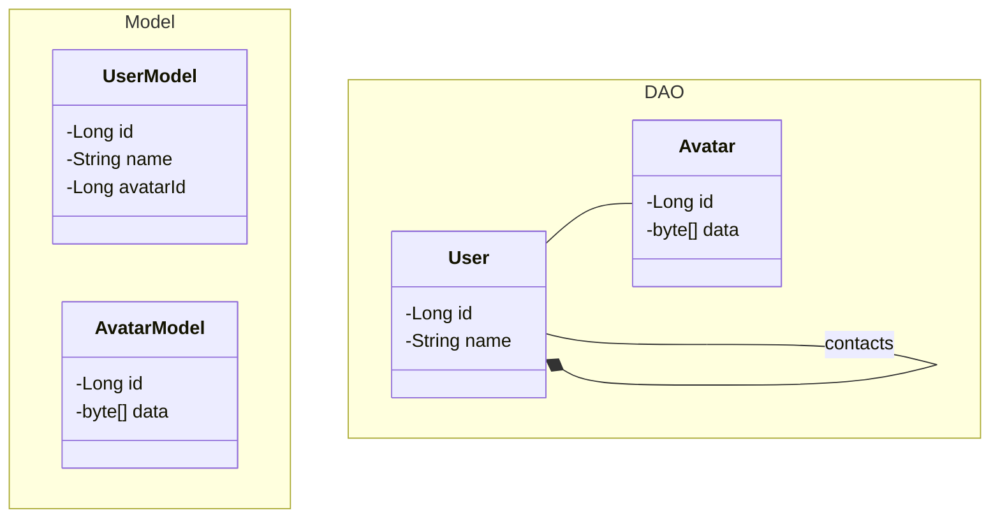

# HATEOS example

## Class Diagram

## REST Requests

`GET /api/users/` : Get all users

`POST /api/users/` : Add user

`PUT /api/users/` : Update user

`GET /api/users/{id}` : Get user by id

`DELETE /api/users/{id}` : Delete user by id

`GET /api/users/{id}/contacts` : Get contacts list of user

`GET /api/avatars/` : Get all avatars

`POST /api/avatars/` : Add avatar

`PUT /api/avatars/` : Update avatar

`GET /api/avatars/{id}` : Get avatar by id

`DELETE /api/avatars/{id}` : Delete avatar by id
